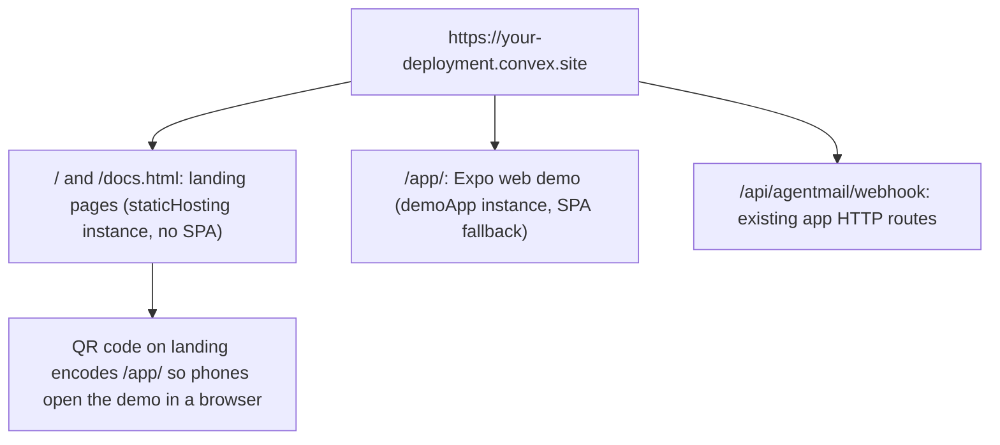

# One Convex .site URL: landing at root, demo app at /app/

## Result

After `npm run site:deploy`, one URL does everything:

Native stays native: the landing page's new "Run it on your phone" section explains that the installable app comes through Expo Go (`npx expo start` + QR), TestFlight, or the stores, while the /app/ link is the instant web preview.

## Changes

### 1. Backend: mount the component

- `npm install @convex-dev/static-hosting` in [packages/backend](packages/backend).
- [packages/backend/convex/convex.config.ts](packages/backend/convex/convex.config.ts): `defineApp({ httpPrefix: "/api" })`, then two instances:
  - `app.use(staticHosting, { httpPrefix: "/" })` for the landing pages (deployed with `--no-spa`, since it is a real multi-page site).
  - `app.use(staticHosting, { name: "demoApp", httpPrefix: "/app/" })` for the Expo web build (SPA fallback on).
- Webhook URL changes from `/agentmail/webhook` to `/api/agentmail/webhook`; update the copy in [docs/integrations.md](docs/integrations.md), the Settings screen AgentMail card, and README.

### 2. Expo web build under /app/

- [apps/native/app.json](apps/native/app.json): add `experiments.baseUrl: "/app"` so exported assets resolve under the sub-path (export-only setting; `npx expo start` is unaffected, verify during smoke test).
- Add a `build:web` script in [apps/native/package.json](apps/native/package.json) using the documented passthrough: `EXPO_PUBLIC_CONVEX_URL=${VITE_CONVEX_URL:-$EXPO_PUBLIC_CONVEX_URL} npx expo export --platform web`.

### 3. Deploy scripts (root package.json)

- `site:preview`: upload both sites to the dev deployment (`upload -d ../../landing -c staticHosting --no-spa` and `upload --build -c demoApp` from packages/backend).
- `site:deploy`: same with `--prod`, plus `npx convex deploy` first.
- Gitignore the Expo `dist/` output.

### 4. Landing pages

- [landing/index.html](landing/index.html): set `DEMO_URL = "/app/"` as the shipped default with a comment (same-origin once hosted on Convex; still overridable for external hosts). New "Run it on your phone" section: a QR rendered client-side from `DEMO_URL` (small inline MIT QR encoder, no external service), plus the three native paths (Expo Go for dev, TestFlight via EAS, the stores).
- [landing/docs.html](landing/docs.html): same DEMO_URL default; new "Host it on Convex" section walking through install, config, and `npm run site:deploy`.

### 5. Docs sync

- New [docs/static-hosting.md](docs/static-hosting.md): full guide (component install, two-instance layout, /api prefix consequence, deploy scripts, custom domains pointer).
- Update [README.md](README.md) (landing section, components-used list gains static-hosting, hosting instructions), [docs/deploy.md](docs/deploy.md) (web demo deploy step), PRD `prds/convex-site-hosting.md`, plus task/changelog/files.

### 6. Verify

- `npx convex dev` deploys the new config clean; typecheck both workspaces.
- `site:preview` against the dev deployment, then browser-check: `/` landing, `/docs.html`, `/app/` demo boots and talks to Convex, QR renders and encodes the right URL, `/api/agentmail/webhook` still routes.

## Caveats (flagged, will verify during implementation)

- `experiments.baseUrl` must not break local `npx expo start`; if it does, the build script passes it via a public env var and app.json stays untouched.
- Two-instance sub-path mounting is documented by the component; route precedence between `/` and `/app/` will be smoke tested first on the dev deployment.
- A public "scan to open in Expo Go" QR needs an EAS Update publish (an Expo account thing); documented as an optional extra, not wired.
